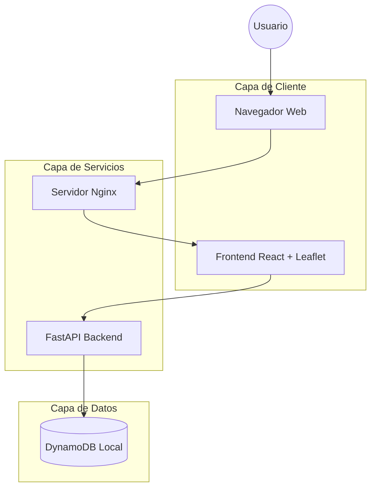

# Arquitectura del Sistema - Urban Incidents

Este documento describe la arquitectura de alto nivel y los componentes del sistema Urban Incidents, una plataforma para el monitoreo y reporte de incidentes urbanos en Pamplona.

## 1. Diagrama de Arquitectura de Alto Nivel

Este diagrama muestra la interacción entre los principales bloques del sistema.



---

## 2. Diagrama de Componentes

Este diagrama detalla la estructura interna de los servicios de Frontend y Backend.

```mermaid
graph TB
    subgraph Frontend_App [Frontend - React]
        App[App.jsx]
        
        subgraph UI_Components [Componentes de UI]
            MapComp[MapContainer - Leaflet]
            HeatMap[HeatMap Layer]
            FormComp[IncidentForm]
            ListComp[IncidentList]
            StatsComp[AnalyticsCharts - Recharts]
        end
        
        subgraph Services [Servicios]
            Axios[Axios API Client]
        end
        
        App --> UI_Components
        UI_Components --> Axios
    end

    subgraph Backend_App [Backend - FastAPI]
        Main[main.py]
        
        subgraph Routes [Rutas / Endpoints]
            IncRouter[/incidents]
            AnaRouter[/analytics]
        end
        
        subgraph Logic_Data [Lógica y Datos]
            Models[Pydantic Models]
            DBManager[DynamoDB Manager]
        end
        
        Main --> Routes
        Routes --> Models
        Routes --> DBManager
    end

    Axios -- "HTTP/JSON" --> Main
    DBManager -- "Boto3" --> DynamoDB[(DynamoDB)]
```

## 3. Stack Tecnológico

- **Frontend:**
  - **React 19:** Biblioteca principal de UI.
  - **Vite:** Herramienta de construcción y desarrollo.
  - **Leaflet & React-Leaflet:** Visualización de mapas e incidentes.
  - **Recharts:** Gráficos estadísticos y analítica.
  - **Axios:** Cliente para consumo de API.

- **Backend:**
  - **FastAPI:** Framework web asíncrono de alto rendimiento.
  - **Pydantic:** Validación de datos y esquemas.
  - **Boto3:** SDK para interacción con Amazon DynamoDB.

- **Infraestructura:**
  - **Docker & Docker Compose:** Containerización y orquestación local.
  - **DynamoDB Local:** Base de datos NoSQL para almacenamiento de incidentes.
  - **Nginx:** Servidor para despliegue del frontend.
